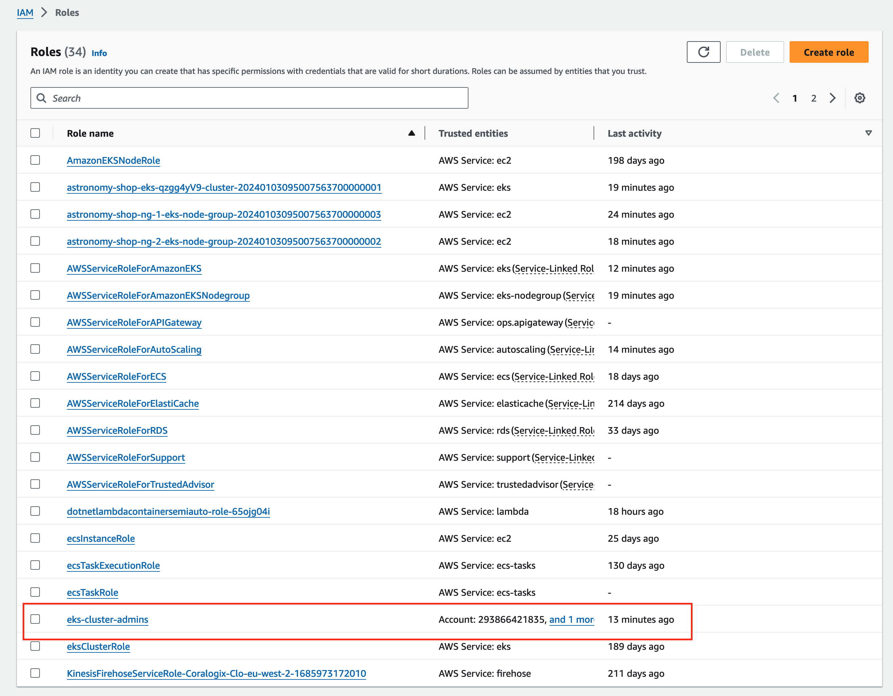
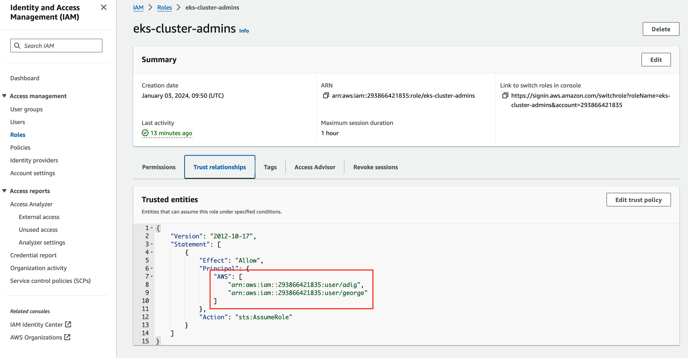
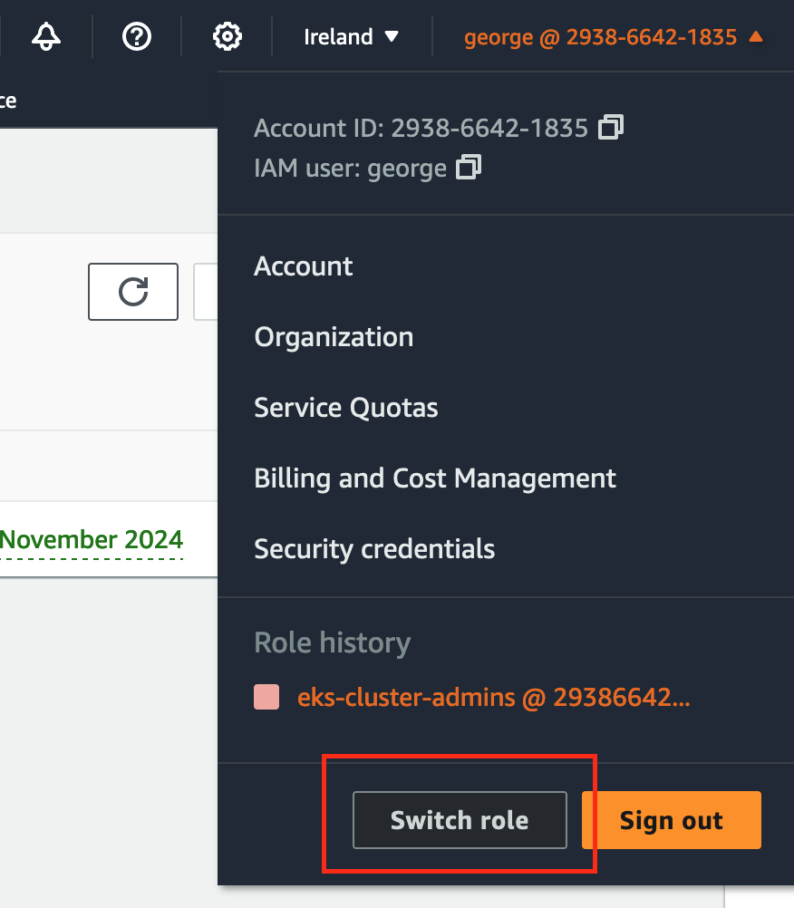

# Astronomy Shop Demo

Astronomy Shop Demo is a re-implementation of the Coralogix OnlineBoutique Demo environment fully as code using the [OpenTelemetry Demo](https://opentelemetry.io/docs/demo/) (Astronomy Shop) instead of the Hipster Shop demo.

> [!WARNING]
> This code is probably terrible and could do with a complete reworking!

> [!NOTE]
> This project is currently deployed in us-west-2
> The terraform state files are stored in a S3 Bucket in the same account as this project, using the Terraform S3 backend provider.
> If multiple clusters are to be deployed in the same AWS account, change the cluster name for each one - it is used as a base for iam roles etc and it will fail if the role already exists

## TODO

- [ ] Update to the latest version of the OTEL Demo Helm Chart
- [ ] Rewrite Lambdas so they are less generic
- [ ] Deploy Lambdas as part of Infrastructure stage
- [ ] Collect Kafka Metrics with OTEL
- [ ] Collect Postgres Metrics with OTEL
- [ ] Review the EKS Cluster configuration
  - [ ] Remove un-needed subnet configuration
  - [ ] Ensure there is no external access to the  ??
- [ ] Create the Coralogix Team Terraform deployment
  - [ ] Extension Packs
  - [ ] Parsing Rules
  - [ ] Alerts
  - [ ] Dashboards
    - [ ] Grafana
    - [ ] Custom Dashboards
  - [ ] TCO Rules
  - [ ] AWS Contextual Data
  - [ ] SLI/SLO Rules

## Description

The project is split into 3 sections. Each Terraform configuration uses AWS S3 as the backend, ensuring that the current state is not stored locally.

### Infrastructure

The Infrastructure folder contains the Terraform code to deploy a new AWS EKS Cluster in the region of your choice.

### Helm

The Helm folder contains a script and helm charts to deploy the [Coralogix otel-integration](https://github.com/coralogix/telemetry-shippers/tree/master/otel-integration/k8s-helm) first as a daemonset, then overriden as a deployment so it can expose a public endpoint for the browser traces. It then deploys the [OpenTelemetry Demo](https://opentelemetry.io/docs/demo/)

As part of the deployment, some of the Error [feature flags](https://opentelemetry.io/docs/demo/feature-flags/) are enabled automatically. 

The included OpenTelemetry Collector configuration has some modifications from the default otel-integration `values.yaml`.

### Coralogix - NOT YET IMPLEMENTED
By default, the OpenTelemetry Demo is deployed into a namespace called `astronomy-demo` and the OTEL Integration daemonset is deployed into a namespace called `monitoring`.

### Coralogix - NOT YET IMPLEMENTED

The Coralogix folder contains the Terraform code to configure the Coralogix Team that the telemetry data from the cluster is being shipped to.

## Getting Started

### Dependencies

- [AWS CLI](https://docs.aws.amazon.com/cli/latest/userguide/getting-started-install.html)
- Terraform CLI
- [AWS IAM Authenicator](https://docs.aws.amazon.com/eks/latest/userguide/install-aws-iam-authenticator.html)

### Deploying

- Configure AWS CLI for the account that will be used to deploy the Demo.
- Create an S3 Bucket for the Terraform backend storage, ensure that the deploying user has access to the Bucket.
- Update the following files

  - `infrastructure/provider.tf`
    - Update the following values:

     ```hcl
    bucket="<name of your S3 bucket>"
    region="<AWS region your bucket is in>"
    ```

  - `infrastructure/variables.tf`
    - Update the following variables as needed:

      ```hcl
      cluster_name="<Your cluster name>"
      cluster_version="<Your AWS cluster version>"
      region = "<AWS_REGION>"
      S3bucketName = "<Your S3 storage bucket name>"
      S3bucketRegion = "<Your S3 storage bucket region>"
      Nodegroup = "<Your node group>"
      InstanceType = "<Your node AWS instance type>"
      min_size = <minimum node count>
      max_size = <maximum node count>
      desired_size = <desired node count>
      ```

  - `helm/1-start.sh`
    - Update to set the Coralogix 2 keys, as well as cluster name Coralogix domain, application, and subsystem

- Run Infrastructure Terraform

  ```bash
  cd infrastructure
  terraform init
  terraform apply
  ```

This process can take some time (~5-10 minutes) to deploy the new cluster. If the `terraform apply` command fails towards the end, re-run it and it will complete successfully.

- Run Helm chart to install the Coralogix-configured otel collector and otel demo

  ```bash
  cd ../helm
  source 1-start.sh
  ```

- Run Coralogix Team Terraform

  **TODO**

### Kubectl access

As part of the infrastructure terraform, the following command is already run as part of the infrastructure terraform code to add the cluster to kubectl
but here it is again just in case

```bash
aws eks --region $(terraform output -raw region) update-kubeconfig --name $(terraform output -raw cluster_name)
```

This will allow you to use `kubectl` to access the new cluster.

### User access to the cluster resources

Once the Infrastructure Terraform code is deployed, there will be a new IAM role (`eks-cluster-admins`) that provides access to any user with that role access to the Cluster in the EKS section of AWS.

The user ARN needs to be added to the Trust Relationship section of the role and then they can use the Switch Role button (with the account number that the cluster was deployed into and the role name `eks-cluster-admins`) to assume the role and view the Cluster.







### Destroying the Cluster

- Remove the Helm chart and Terraform

Always stop the demo on the cluster before tearing the cluster down, because the demo creates 2 load balancers that terraform does not know about

  ```bash
  cd helm
  source 2-stop.sh
  ```

- Run Infrastructure Terraform

  ```bash
  cd ../infrastructure
  terraform destroy
  ```

This process can take some time (~5-10 minutes) to destroy the cluster. If the `terraform destroy` command fails towards the end, re-run it and it will complete successfully.
